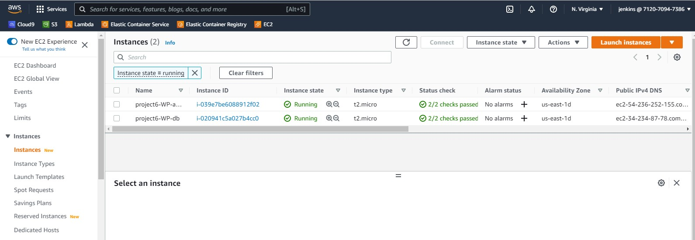

# **WEB SOLUTION WITH WORDPRESS, DISTRIBUTED SERVER ARCHITECTURE** #

This project task is to prepare storage infrastructure on two Linux servers and implement a basic web solution using WordPress. 
WordPress is a free and open-source content management system written in PHP and paired with MySQL or MariaDB as its backend Relational Database Management System (RDBMS).

### **TASK ONE** ###
Launch two Red Hat Linux EC2 instances

Update and upgrade the two servers
~~~
sudo yum update -y && sudo yum upgrade -y
~~~

### **TASK TWO** ###
Create and attach three EBS (**ELASTIC BLOCK STORE**) to each of the servers. These will be used to create LVs (**LOGICAL VOLUMES**) on the servers.
Create EBS

[image](ebs-vol.jpg)
