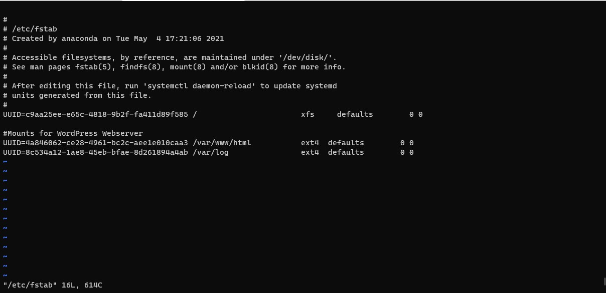

# **WEB SOLUTION WITH WORDPRESS, DISTRIBUTED SERVER ARCHITECTURE** #

This project task is to prepare storage infrastructure on two Linux servers and implement a basic web solution using WordPress. 
WordPress is a free and open-source content management system written in PHP and paired with MySQL or MariaDB as its backend Relational Database Management System (RDBMS).

### **TASK ONE** ###
Launch two Red Hat Linux EC2 instances

Update and upgrade the two servers
~~~
sudo yum update -y && sudo yum upgrade -y
~~~

### **TASK TWO** ###
Create and attach three EBS (**ELASTIC BLOCK STORE**) to each of the servers. These will be used to create LVs (**LOGICAL VOLUMES**) on the servers.
Create EBS
Ensure the volumes and your EC2 instances are on the **same availability zone**.

Attach the volumes to each server, three per server.

To attach a volume to a server
- [x] Select the volume to be attached on the Volumes page
- [x] Click on Action tab
- [x] Click on Attach volume
- [x] Select the instance you want to attach the volume to
- [x] Click on Attach

Confirm the attached volumes with
~~~
sudo lsblk
~~~

Create a partition on each of the volume attached 
~~~
sudo gdisk /dev/xvdf
sudo gdisk /dev/xvdg
sudo gdisk /dev/xvdh
~~~

Check again
~~~
sudo lsblk
~~~

Install *lvm2*
~~~
sudo yum install lvm2
~~~
Run lvmdiskscan to check available partitions
~~~
sudo lvmdiskscan
~~~
Use pvcreate to mark each of 3 disks as physical volumes (PVs) to be used by LVM
~~~
sudo pvcreate /dev/xvdf1
sudo pvcreate /dev/xvdg1
sudo pvcreate /dev/xvdh1
~~~
Confirm the physical volumes
~~~
sudo pvs
~~~

Use *vgcreate* utility to add all 3 PVs to a volume group (VG). Name the VG **webdata-vg**
~~~
sudo vgcreate webdata-vg /dev/xvdh1 /dev/xvdg1 /dev/xvdf1
~~~
Check the volume groups
~~~
sudo vgs
~~~

Use *lvcreate* utility to create 2 logical volumes. **apps-lv** (Use half of the PV size), and **logs-lv** Use the remaining space of the PV size. NOTE: apps-lv will be used to store data for the Website while, logs-lv will be used to store data for logs
~~~
sudo lvcreate -n apps-lv -L 14G webdata-vg
sudo lvcreate -n logs-lv -L 14G webdata-vg
~~~

Confirm the *Logical Volumes*
~~~
sudo lvs
~~~

Verify all to view view complete setup - VG, PV, and LV
~~~
sudo vgdisplay -v
sudo lsblk
~~~

Use *mkfs.ext4* to format the logical volumes with *ext4* filesystem
~~~
sudo mkfs -t ext4 /dev/webdata-vg/apps-lv
sudo mkfs -t ext4 /dev/webdata-vg/logs-lv
~~~

Create /var/www/html directory to store website files
~~~
sudo mkdir -p /var/www/html
~~~
Create /home/recovery/logs to store backup of log data
~~~
sudo mkdir -p /home/recovery/logs
~~~
Mount /var/www/html on apps-lv logical volume
~~~
sudo mount /dev/webdata-vg/apps-lv /var/www/html/
~~~
Use rsync utility to backup all the files in the log directory /var/log into /home/recovery/logs (This is required before mounting the file system)
~~~
sudo rsync -av /var/log/. /home/recovery/logs/
~~~
Mount /var/log on logs-lv logical volume. (Note that all the existing data on /var/log will be deleted. That is why step 15 above is very
important)
~~~
sudo mount /dev/webdata-vg/logs-lv /var/log
~~~
Restore log files back into /var/log directory
~~~
sudo rsync -av /home/recovery/logs/. /var/log
~~~

### **TASK THREE** ###
UPDATE THE `/ETC/FSTAB` FILE

Use this command to to obtain the UUID of each of the LVs (logical volume)
~~~
sudo blkid
~~~

Edit /etc/fstab
~~~
sudo vi /etc/fstab
~~~
edit as shown below:

Test the configuration and reload the daemon
~~~
 sudo mount -a
 sudo systemctl daemon-reload
~~~

REPEAT above for the second **‘DB Server’**
Repeat the same steps as for the Web Server, but instead of *apps-lv* create *db-lv* and mount it to */db* directory instead of */var/www/html/*.

### **TASK FOUR** ###
Install wget, Apache and it’s dependencies
~~~
sudo yum -y install wget httpd php php-mysqlnd php-fpm php-json
~~~

Start Apache
~~~
sudo systemctl enable httpd
sudo systemctl start httpd
~~~

Install PHP and it’s depemdencies
~~~
sudo yum install https://dl.fedoraproject.org/pub/epel/epel-release-latest-8.noarch.rpm
sudo yum install yum-utils http://rpms.remirepo.net/enterprise/remi-release-8.rpm
sudo yum module list php
sudo yum module reset php
sudo yum module enable php:remi-7.4
sudo yum install php php-opcache php-gd php-curl php-mysqlnd
sudo systemctl start php-fpm
sudo systemctl enable php-fpm
setsebool -P httpd_execmem 1
~~~
